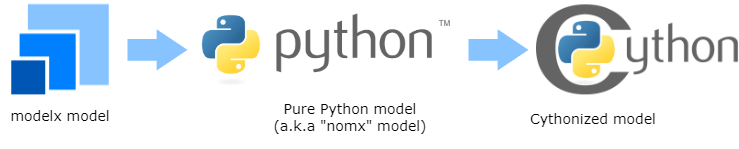

# modelx-cython: Cythonize modelx models

**modelx-cython** is a Python package that translates
[modelx](https://github.com/fumitoh/modelx) models exported as pure-Python
packages into [Cython](https://cython.org/) packages and compiles them into
native extension modules, so that the models run faster and use less memory.

```{warning}
modelx-cython is currently highly experimental and is released only for
early adopters with advanced software engineering skills to explore its
capability.
```



modelx-cython installs the {doc}`mx2cy <cli>` command.  Given a model
exported by modelx's `Model.export` method, `mx2cy` runs a user-supplied
sample script to observe the types that flow through the model, rewrites the
model's source code with Cython type annotations, and compiles the result
into a new package that can be imported in place of the original.

```console
$ mx2cy Model_nomx
```

## Documentation contents

```{toctree}
:maxdepth: 2

installation
tutorial
cli
spec
freethreading
implementation
```

## See also

* [modelx GitHub Repository](https://github.com/fumitoh/modelx)
* [modelx Documentation](https://docs.modelx.io)
* [modelx Blog](https://modelx.io/allposts)

## License

Copyright 2023-2026, Fumito Hamamura

modelx-cython is free software; you can redistribute it and/or modify it
under the terms of the
[GNU Lesser General Public License v3 (LGPLv3)](https://github.com/fumitoh/modelx-cython/blob/main/LICENSE.txt).

Portions of modelx-cython are derived from
[MonkeyType](https://github.com/Instagram/MonkeyType), which is distributed
under a BSD-style license.
